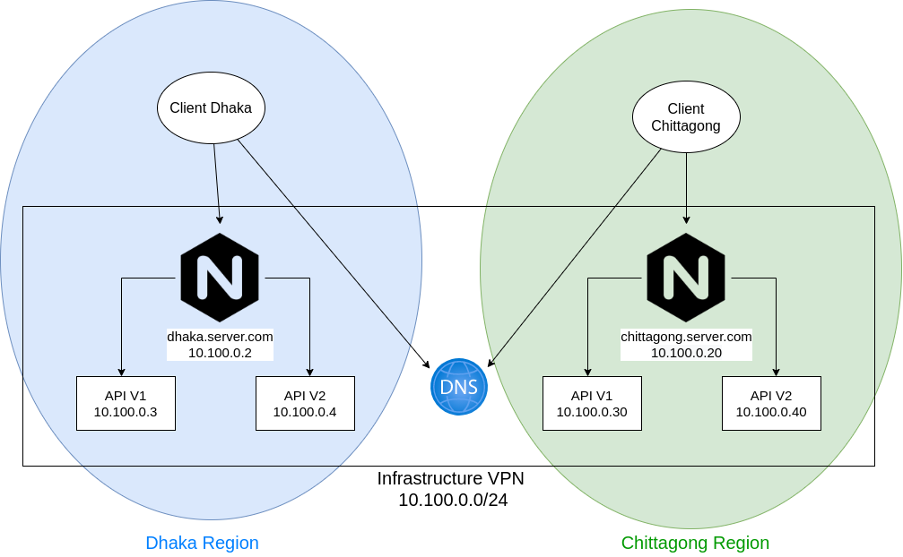

## Distributed System with Docker

This repo is a simple implementation of a geo-distributed system with flask, nginx, and docker. The system has the following architecture.



#### Installation

To run the system you need only docker installed

```bash
$ sudo apt-get install docker.io
```

Additionally put the following configuration in **/etc/hosts**. (This is for the fake dns)

```bash
# In /etc/hosts
10.100.0.2  dhaka.server.com
10.100.0.20 chittagong.server.com
```

#### Run the system

##### Server

First build the containers with

```bash
docker-compose builld
```

Now run the servers with

```bash
docker-compose up
```

##### Server

The client is separate from the docker system. To run it, install python virtualenv and the python dependencies in the virutalenv.

```bash
$ virtualenv env
$ . env/bin/activate 
$ (env) pip install -r client/requirements.txt
```

Now run the client.

```bash
$ (env) python client/client.py
```

In the client try alternating the following domains:
* dhaka.server.com
* chittagong.server.com